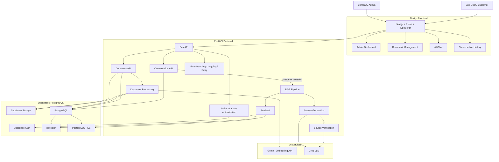
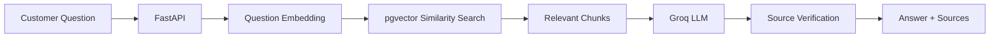
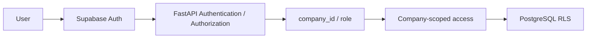

# Nova AI Assistant

Nova AI Assistant is an AI-powered SaaS knowledge and customer-support assistant.
Companies upload their own documents, build a company-scoped knowledge base, and
give authenticated users grounded answers with supporting sources. The project
combines a Next.js interface, a FastAPI backend, Supabase, PostgreSQL/pgvector,
Gemini embeddings, and Groq generation.

**Stack:** Next.js · React · TypeScript · FastAPI · PostgreSQL · pgvector · Supabase · Gemini · Groq

## Overview

Nova addresses the problem of finding reliable answers across internal company
documents. Administrators upload PDF, TXT, or DOCX files; the backend extracts
text, chunks it, generates embeddings, and stores the searchable knowledge in
PostgreSQL with pgvector. Authenticated users ask questions through the AI
Assistant, and the RAG pipeline retrieves only relevant knowledge for their
company before generating an answer.

Answers are checked against the retrieved evidence and return source metadata
when the evidence supports the answer. If the knowledge base is insufficient,
Nova returns a safe no-answer response instead of inventing an answer.
Conversations and messages are persisted separately from the knowledge base and
remain scoped to the authenticated user and company.

## Features

### Authentication & SaaS

- Supabase email/password authentication
- Company/workspace onboarding
- Admin and end-user roles
- Backend authorization derived from the authenticated profile
- Company-scoped document, knowledge-base, and conversation access

### Document Management

- Upload PDF, TXT, and DOCX documents up to 10 MB
- Upload, processing, ready, and failed statuses
- Replace/reprocess existing documents
- Delete document metadata and storage objects
- Knowledge-base synchronization through atomic chunk replacement
- Admin-only document mutations

### AI / RAG

- Text extraction and deterministic chunking
- Gemini Embedding API for document chunks and questions
- Company-scoped PostgreSQL + pgvector similarity search
- Retrieval restricted to ready documents with non-null embeddings
- Groq grounded answer generation
- Groq source verification over retrieved knowledge-base excerpts
- Answers with verified source metadata
- Safe no-answer behavior when evidence is missing or insufficient

### Conversations

- Create, list, retrieve, and delete conversations
- Persisted user and assistant messages
- Follow-up questions using bounded recent context
- Independent conversations with isolated context
- Atomic message indexes and duplicate-safe message appends
- Conversation history kept outside the knowledge base and pgvector

### Reliability & Security

- PostgreSQL row-level security policies
- Backend ownership, role, and company checks
- Safe user-facing HTTP errors
- Centralized handling for unexpected FastAPI exceptions
- Technical logging for failures and important operations
- Bounded retry for safely retryable document-processing failures
- Processing-generation guards against stale work
- Duplicate-safe document chunk replacement
- Validation of malformed retrieval results and source-verification output

### Developer / Operations

- FastAPI OpenAPI schema and Swagger UI
- 162 backend tests in the current suite
- Python compilation checks
- Frontend TypeScript validation and production builds
- Docker and Docker Compose support
- Production-style Next.js standalone container
- Backend health check and Compose dependency health check

## Architecture

Nova follows a layered architecture with **FastAPI as the central backend
layer**. The frontend provides the authenticated SaaS experience, while FastAPI
coordinates authorization, document processing, retrieval-augmented generation,
conversation persistence, source verification, and reliability safeguards.
Supabase provides authentication, storage, PostgreSQL, pgvector, and database
row-level security.



## RAG Pipeline

### Document ingestion


### Question answering



Embeddings are generated for document chunks during processing and for each
question at query time. Retrieval is company-scoped and uses processed,
ready-document chunks. Conversation history may help interpret a follow-up
question, but it is generation context only: it is not embedded, inserted into
pgvector, or treated as knowledge-base evidence.

The current source metadata includes document and chunk identifiers, filename,
chunk index, and similarity. It does not provide page-level citations.

Gemini is used for embeddings. Groq is used for answer generation and source
verification; Gemini is not the current answer-generation model.

## Security & Multi-Tenancy

- Supabase Auth authenticates the user.
- FastAPI resolves the authenticated profile and derives `user_id`, `company_id`,
  and role from that profile.
- Client-provided company identifiers are not trusted for authorization.
- Backend checks enforce company and role boundaries before data access or
  mutation.
- PostgreSQL RLS provides a database-level protection layer.
- Documents and knowledge-base retrieval are company-scoped.
- Conversations and messages are scoped to both company and owning user.
- Service-role access is used by the backend, but backend authorization checks
  remain mandatory.
- Storage paths are organized under company/document scope.



## Tech Stack

| Layer | Technology | Purpose |
|---|---|---|
| Frontend | Next.js, React, TypeScript | Authenticated dashboard, document UI, and AI chat |
| Backend | Python, FastAPI | API routes, authorization, document processing, RAG orchestration |
| Database | PostgreSQL, pgvector | Tenant-scoped metadata, messages, chunks, and vector search |
| Authentication | Supabase Auth | User authentication and session identity |
| Authorization | FastAPI checks, PostgreSQL RLS | Role, ownership, and company boundaries |
| Storage | Supabase Storage | Original uploaded documents |
| AI embeddings | Gemini Embedding API | Document and question embeddings |
| AI generation | Groq LLM | Grounded answers and source verification |
| Document processing | Python PDF/DOCX/TXT processing | Text extraction, validation, and chunking |
| Containers | Docker, Docker Compose | Local production-style container execution |
| Testing / API | pytest, OpenAPI, Swagger UI | Automated tests and interactive API documentation |
| Version control | Git, GitHub | Source control and repository hosting |

## Project Structure

```text
.
├── frontend/
│   ├── app/
│   │   ├── chat/
│   │   ├── dashboard/
│   │   ├── documents/
│   │   ├── login/
│   │   └── signup/
│   ├── components/
│   ├── lib/supabase/
│   ├── Dockerfile
│   └── package.json
├── backend/
│   ├── app/
│   │   ├── conversations.py
│   │   ├── document_processing.py
│   │   ├── documents.py
│   │   ├── embeddings.py
│   │   ├── generation.py
│   │   ├── main.py
│   │   ├── rag.py
│   │   └── retrieval.py
│   ├── tests/
│   ├── Dockerfile
│   └── requirements.txt
├── supabase/
│   └── migrations/
├── docker-compose.yml
├── .env.example
├── .gitignore
└── README.md
```

## API Overview

The backend exposes interactive OpenAPI documentation at `/docs`.

### Documents

| Method | Endpoint | Purpose |
|---|---|---|
| `POST` | `/documents` | Upload and begin processing a document |
| `GET` | `/documents` | List documents visible to the authenticated company |
| `GET` | `/documents/{document_id}` | Retrieve one authorized document |
| `PUT` | `/documents/{document_id}` | Replace and reprocess an authorized document |
| `DELETE` | `/documents/{document_id}` | Delete an authorized document and its storage object |

### RAG

| Method | Endpoint | Purpose |
|---|---|---|
| `POST` | `/rag/query` | Return a company-scoped grounded answer and verified sources |

### Conversations

| Method | Endpoint | Purpose |
|---|---|---|
| `POST` | `/conversations` | Create a persisted conversation |
| `GET` | `/conversations` | List the authenticated user's conversations |
| `GET` | `/conversations/{conversation_id}` | Retrieve an authorized conversation |
| `DELETE` | `/conversations/{conversation_id}` | Delete a conversation and its messages |
| `GET` | `/conversations/{conversation_id}/messages` | Load messages in chronological order |
| `POST` | `/conversations/{conversation_id}/messages` | Ask a question and persist a successful turn |

### Health

| Method | Endpoint | Purpose |
|---|---|---|
| `GET` | `/health` | Return `{"status":"ok"}` when the API is running |

There are no separate backend authentication endpoints; authentication is
handled by Supabase Auth and the frontend session is sent to protected API
routes as a bearer token.

## Document Processing

Documents follow this lifecycle:

```text
UPLOADED → PROCESSING → READY
                         ↘ FAILED
```

The upload endpoint validates the filename, type, size, and content before
storing the original object. Background processing extracts text, creates
deterministic chunks, generates an embedding for every chunk, and atomically
replaces the document's chunks before marking the document ready.

Replacing a document increments its processing generation. Generation checks
prevent stale work from overwriting newer document state. Transient provider
failures receive bounded retries; permanent validation and processing failures
are marked failed without unsafe retries. Unique constraints and guarded
database functions prevent duplicate or stale chunk writes.

## Conversations

Conversations and messages are persisted in PostgreSQL and scoped to the
authenticated user and company. A message turn retrieves current company
knowledge using the question, then passes a bounded recent history to answer
generation. History is never added to the knowledge base or embedded into
pgvector, and independent conversations do not share context.

The conversation message flow persists the user and assistant messages only
after successful RAG/generation and source verification. An unknown question
returns the safe no-answer response with no sources.

## Error Handling & Reliability

- Validation errors return safe, user-facing HTTP details.
- Unexpected FastAPI exceptions are logged with technical context and return a
  generic server error response.
- Provider and database failures are converted into controlled API errors.
- Document processing retries only failures classified as safely retryable and
  stops after a bounded number of attempts.
- Processing-generation guards prevent stale replacement work from updating a
  newer document version.
- Retrieval rows, similarity values, metadata, and source-verification output
  are validated before they are used.
- Technical logs are emitted for document, storage, retrieval, generation,
  conversation, and processing failures without exposing API keys.

## Testing & Validation

The current backend suite contains 162 tests covering authentication-related
boundaries, documents, processing, embeddings, RAG, source verification,
conversations, retries, and error handling.

The project validation commands are:

```powershell
cd backend
.\.venv\Scripts\python.exe -m pytest
.\.venv\Scripts\python.exe -m compileall -q app tests
cd ..\frontend
npx tsc --noEmit
npm run build
cd ..
docker compose config
git diff --check
```

Provider-dependent and authenticated manual scenarios require configured
Supabase, Gemini, and Groq credentials. The automated tests use mocks and
focused fixtures where external services are not required.

## Running Locally

### Prerequisites

- Node.js 20 or later
- Python 3.11 or later
- Docker Desktop is optional for containerized execution

### Environment variables

For native development, use the environment templates as a guide:

- `frontend/.env.local` contains public frontend values:
  `NEXT_PUBLIC_API_URL`, `NEXT_PUBLIC_SUPABASE_URL`, and
  `NEXT_PUBLIC_SUPABASE_PUBLISHABLE_KEY`.
- `backend/.env` contains server-only values:
  `SUPABASE_URL`, `SUPABASE_SERVICE_ROLE_KEY`, `GEMINI_API_KEY`,
  `GROQ_API_KEY`, `GROQ_GENERATION_MODEL`, and `FRONTEND_ORIGIN`.
- The root `.env.example` documents the variables used by Docker Compose.

Never place service-role, Gemini, or Groq secrets in frontend `NEXT_PUBLIC_*`
variables or commit local `.env` files.

### Frontend

```powershell
cd frontend
npm install
npm run dev
```

The frontend starts at <http://localhost:3000>.

### Backend

```powershell
cd backend
python -m venv .venv
.\.venv\Scripts\Activate.ps1
pip install -r requirements.txt
uvicorn app.main:app --reload --host 0.0.0.0 --port 8000
```

The API starts at <http://localhost:8000>.

### Docker Compose

From the repository root, provide the documented variables through the root
`.env` file or the intended environment-file mechanism, then run:

```powershell
docker compose build
docker compose up -d
docker compose ps
docker compose logs --tail=100
docker compose down
```

Do not use `docker compose down -v` unless you intentionally want to remove
volumes and project data.

## API Documentation

With the backend running, open Swagger UI at:

<http://localhost:8000/docs>

The raw OpenAPI schema is available at:

<http://localhost:8000/openapi.json>

## Docker

The Compose configuration runs two services:

- **Frontend:** a multi-stage Next.js standalone build served by `node server.js`
  on port 3000.
- **Backend:** a Python 3.11 image running a non-reloading Uvicorn server on
  port 8000.

The backend includes a healthcheck, and the frontend waits for the backend to
become healthy. The Compose configuration has no development source bind
mounts and uses runtime environment variables for server-only credentials. This
is a production-style local/demo setup, not a cloud deployment.

## Environment & Configuration

`.env.example`, `frontend/.env.example`, and `backend/.env.example` document
the expected configuration without containing credentials. Frontend
`NEXT_PUBLIC_*` values are public by design. Supabase service-role,
Gemini, and Groq credentials are server-only backend values.

The backend reads `FRONTEND_ORIGIN` for CORS and supports a comma-separated list
of browser origins. The default local origin is `http://localhost:3000`.

## Future Improvements

The following are outside the current MVP:

- Billing and subscriptions
- Advanced analytics and notifications
- Larger-scale team management
- Additional document and service integrations
- Advanced AI agents
- Cloud deployment and larger-scale infrastructure

## Project Status

The Nova AI Assistant MVP is complete through the current implemented
functionality and has been validated with the backend test suite, Python
compilation, frontend TypeScript validation, frontend production build, and
Docker Compose configuration checks. It has not been represented as a deployed
cloud service.

## License

This repository does not currently contain a `LICENSE` file, so licensing has
not yet been specified.

## Author / Contact

Repository: <https://github.com/Manar8765/nova-ai-assistant>
